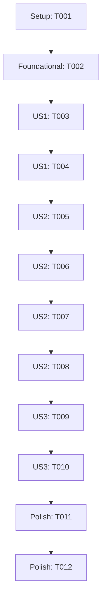

# Feature Tasks: Dynamic PDF Review Pipeline Automation

**Branch**: `002-pdf-review-pipeline` | **Date**: 2026-05-20 | **Spec**: [spec.md](file:///Users/kenyim/.gemini/antigravity/scratch/math-answer-review/specs/002-pdf-review-pipeline/spec.md)
**Input**: Feature plan from `/specs/002-pdf-review-pipeline/plan.md`

## Phase 1: Setup

- [ ] T001 Create default settings configuration to manage paths dynamically in `config.py`

## Phase 2: Foundational

- [ ] T002 Implement abstract prompt runner wrapper in `analyze_all.py` to decouple Gemini subprocess execution from testing

## Phase 3: User Story 1 - PDF Page Extraction (US1)

**Goal**: Extract all pages from a target PDF file to high-resolution PNGs programmatically.  
**Test**: Run extraction function and verify correct counts of PNG images matching the page count of the source PDF.

- [ ] T003 [P] [US1] Create page extraction module in `pdf_extractor.py` using PyMuPDF
- [ ] T004 [US1] Refactor `resize_and_preview.py` to dynamically find and resize PNG files in the output directories without hardcoded limits

## Phase 4: User Story 2 - Dynamic Multi-Page Analysis (US2)

**Goal**: Loop through all resized pages dynamically, run Gemini visual analysis with caching, crop sub-elements, and generate reviews.  
**Test**: Verify that already-analyzed pages are skipped, and all new pages are visual-analyzed, cropped, and saved.

- [ ] T005 [P] [US2] Update `analyze_all.py` to dynamically count page images and request visual analysis without hardcoded ranges
- [ ] T006 [US2] Update `analyze_all.py` to check for cached raw JSON page results and skip already-analyzed pages
- [ ] T007 [P] [US2] Refactor `crop_images.py` to accept custom directory paths and execute coordinate crops dynamically
- [ ] T008 [US2] Refactor `generate_review.py` to accept configurable parameters and generate HTML dynamically based on the compile cache JSON

## Phase 5: User Story 3 - Unified Pipeline Command (US3)

**Goal**: Run all sub-components using a single runner script.  
**Test**: Execute runner script with input PDF path, verify index.html is generated correctly.

- [ ] T009 [P] [US3] Create unified entry point runner script `run_pipeline.py` to orchestrate extraction, resizing, analysis, cropping, and HTML generation
- [ ] T010 [US3] Create testing suite in `test_pipeline.py` to mock Gemini execution and verify all pipeline components in isolation

## Phase 6: Polish & Verification

- [ ] T011 Execute the unified pipeline on `/Users/kenyim/Downloads/Basic Properties of Circles - DSE Past Paper.pdf`
- [ ] T012 Verify KaTeX rendering and interactive review styling on the generated `index.html`

---

## Dependency Graph

## Implementation Strategy
- **MVP Goal**: Successfully convert a PDF, run cached mock visual analysis, crop sub-elements, and generate HTML.
- **Incremental Steps**:
  1. Build PDF to PNG extraction utility using PyMuPDF and Pillow.
  2. Implement caching logic and parameterize directories.
  3. Create the coordinator CLI.
  4. Run on target PDF.
